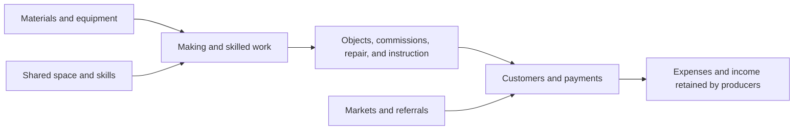

# Portland makes things. How much of that economy can we see?

*Portland Civic Lab · Evidence reviewed September 15, 2026*

Portland sculptor Martin Eichinger asked: “Is the entire Portland creative economy measurable? Does the city auditor track this sector of our larger economy?”

**Much of the creative economy is measurable, but the available measures do not describe one complete, consistently defined sector. Portland's makers are particularly difficult to count.** Public records establish paid production, business receipts, creative employment, and shared production facilities. They do not yet establish how many unique people make things within Portland, how many earn their living from it, or the total economic value they create.

The City Auditor examines government performance. Its recent arts audit concerns the management of arts education and access funding. In the auditor's mandate, report index, and arts audit reviewed for this article, we found no comprehensive, recurring census of Portland's creative or maker economy. That is a finding about the public material examined, not proof that no relevant unpublished work exists. [Audit Services](https://www.portland.gov/auditor/audit-services) · [Report index](https://www.portland.gov/auditor/audit-services/about-us/audit-reports-online) · [March 2026 audit](https://www.portland.gov/auditor/audit-services/news/2026/3/18/arts-tax-city-needs-make-improvements-deliver-voter-approved)

The useful next step is to connect existing economic evidence to the actual work of artists, fabricators, and small producers. That can answer considerably more than a search for a single headline number.

## What are we counting?

This investigation uses three overlapping lenses:

| Lens | What belongs here | What the lens helps explain |
|---|---|---|
| Creative economy | Arts, design, media, performance, and related creative production | The larger labor market and business context |
| Maker economy | Physical art, craft, fabrication, furniture, ceramics, textiles, jewelry, printmaking, hardware prototypes, and creative repair | Who produces tangible work, for whom, and under what conditions |
| Supporting infrastructure | Workshops, studios, tools, instruction, suppliers, markets, and sales networks | How people gain access to production and customers |

These are research definitions, not three official statistical sectors. A sculptor can belong to all three as a producer, studio member, and teacher. A graphic designer belongs in the creative economy but does not automatically belong in the physical-maker count. A furniture factory may appear in a relevant industry table without fitting our focus on independent and small-scale making.

Paid commissions, side businesses, hobby projects, learning, and volunteering all belong in the participation picture. Only some represent market production or paid employment. Food, beverages, and large-scale manufacturing remain adjacent sectors here.

We prioritize activity inside Portland city limits. County figures are labeled as county figures; the tri-county region means Multnomah, Washington, and Clackamas. A Portland mailing address, a Portland customer, and a Portland workplace are different geographic facts.

## The broader creative economy already has a measurable presence

The regional cultural plan's WESTAF snapshot reports **44,704 creative jobs and approximately $5.0 billion in creative-industry earnings in 2022** across the three counties. It includes payroll employment, other employees, and self-employment. Its scope is broad: marketing managers appear among the largest occupations, and software publishing accounts for a reported $1.8 billion of industry earnings. These are useful regional benchmarks, not a count or valuation of Portland makers. Occupation jobs and industry earnings also describe different statistical universes. [Regional snapshot, pages 1–2](https://ourcreativefuture.org/wp-content/uploads/2024/03/Tri-County-Creative-Economy-Report-2022.pdf)

A separate Portland nonprofit arts study, AEP6, reports **$405.1 million in combined organization and audience expenditures for FY2022** and **6,446 modeled jobs supported**, including indirect and induced effects. The study received financial and attendance information from 184 of 894 eligible organizations and did not expand organization results to cover nonrespondents. Its economic model uses Multnomah County, and its definition of a local attendee is a county resident. These findings establish substantial activity around participating nonprofits; they do not measure the entire creative economy. [Portland AEP6 summary, pages 1–2](https://racc.org/wp-content/uploads/2026/03/OR_CityOfPortland_AEP6_OnePageSummaryOfFindings.pdf)

A source correction matters: RACC's overview labels 4,589,494 as dollars of audience spending. The original table identifies it as **attendances**; estimated audience spending is **$167,314,696**. Our extracts follow the original report. [RACC overview](https://racc.org/advocacy-community-engagement/aep6/)

Do not add these studies together. Their geography, definitions, accounting measures, and covered organizations overlap.

## What makerspaces and independent studios actually create

The public record supports several kinds of output. The accompanying [six case studies](case-studies.md) separate documented work from advertised capabilities and unknown financial results.

- **Past Lives:** a shared production facility whose public materials describe furniture, metalwork, commissions, and industrial prototyping. Its website reports 175 members and 176 completed commissions, but supplies no reporting period for those counters. They establish an operator's description of scale, not current employment or annual output. [Past Lives](https://www.pastlives.space/home)
- **ADX:** studios, shared woodworking, and exhibition opportunities link independent creative work to workspace and audiences. Its community includes more than physical makers, so its reported community size cannot be treated as a craft workforce. [ADX studios](https://artdesignxchange.com/art-studios-portland)
- **Morning Ceramics:** studio access, outside firing, and wheel rental serve different production arrangements, including making at home. Its market archive documents opportunities to bring ceramics to buyers; it does not disclose sales proceeds. [Services](https://www.morningceramics.com/services) · [Markets](https://www.morningceramics.com/markets)
- **PDX Hackerspace:** technical facilities and a process for matching members to contract projects connect learning and experimentation with possible paid work. Public information does not quantify delivered commercial projects. [Project and membership FAQ](https://pdxhackerspace.org/FAQ.html)
- **Eichinger Sculpture Studio:** a commission portfolio documents bronze sculpture for local institutions and destinations outside Oregon. It demonstrates a route to outside demand, while contract values and the location of subcontracted production remain unknown. [Commissions](https://www.eichingersculpture.com/commission)
- **Rachael Potter Ceramics:** the operator describes home-studio production and local purchases of clay and glaze. This is evidence of a supply relationship that a makerspace membership census could miss. The business's precise city-boundary location is unverified. [Studio description](https://www.rachaelpotter.com/)

The economic chain to investigate is straightforward:

This is an analytical framework, not a measured flow of dollars. A venue's membership receipts, its members' sales, and a supplier's revenue can describe successive transactions in the same chain. Adding them does not produce local value added.

## The payroll evidence shows a mixed picture

Detailed public payroll data allow us to examine **Multnomah County**, not isolate Portland city makers. The table below reports private-sector annual-average jobs in selected industries. These are all covered jobs in those industries, including work outside the maker definition.

| Industry | Jobs, 2019 | Jobs, 2025 | Change |
|---|---:|---:|---:|
| Pottery, ceramics, and plumbing fixtures | 41 | 65 | +58.5% |
| Nonupholstered wood household furniture | 94 | 68 | −27.7% |
| Custom architectural woodwork and millwork | 46 | 69 | +50.0% |
| Jewelry and silverware | 106 | 127 | +19.8% |
| Musical instruments | 51 | 36 | −29.4% |
| Graphic design services | 1,041 | 566 | −45.6% |
| All private industries, county benchmark | 447,067 | 415,659 | −7.0% |

Source: BLS Quarterly Census of Employment and Wages (QCEW), [2019](https://data.bls.gov/cew/data/api/2019/a/area/41051.csv) and [2025](https://data.bls.gov/cew/data/api/2025/a/area/41051.csv), private ownership, all establishment sizes. [Full extracts and calculations](data/derived/tables.md)

Some small production categories grew while others contracted. Small starting counts also produce large percentage changes. This evidence does not support one growth narrative for the whole maker economy, or establish why an industry changed.

There are signs of local specialization. In 2025, jewelry and silverware manufacturing's share of county employment was approximately twice its national share: BLS reports a location quotient of 1.98. That comparison concerns an industry, not the artistic quality or profitability of its producers. Its average annual payroll pay was $53,439, compared with $80,983 across the county's private industries. These are nominal averages affected by working hours and job mix; neither measures an independent jeweler's take-home income. [2025 QCEW](https://data.bls.gov/cew/data/api/2025/a/area/41051.csv)

Several small categories have suppressed employment data, including commercial screen printing. Suppressed means unknown, not zero. Payroll data also exclude proprietors and unincorporated self-employed workers. [QCEW coverage](https://www.bls.gov/cew/overview.htm)

## Businesses without employees are a substantial part of the picture

Census Nonemployer Statistics reveal activity that payroll-only analysis misses. The following are **2023 Multnomah County businesses and gross receipts**, not people or profit:

| Industry category | Nonemployer businesses | Gross receipts |
|---|---:|---:|
| Independent artists, writers, and performers | 7,472 | $177.9 million |
| Specialized design services | 2,051 | $80.6 million |
| Furniture and related products | 101 | $4.5 million |
| Apparel manufacturing | 98 | $3.8 million |
| Clay products and refractories | 30 | $0.8 million |

Source: [Census 2023 county file](https://www2.census.gov/programs-surveys/nonemployer-statistics/datasets/2023/historical-datasets/nonemp23co.zip). These categories include non-makers. Receipts incorporate disclosure noise. County assignment usually follows the business mailing address, which may differ from where production occurs. [Census methodology](https://www.census.gov/programs-surveys/nonemployer-statistics/technical-documentation/methodology.html) · [Extracts and additional categories](data/derived/tables.md)

For the independent-artist category, average gross receipts were approximately **$23,810 per business**. That average is before materials, studio costs, services, and other expenses. It is not the median, a full-time wage, or a measure of household income. Businesses may operate part time, and one person may combine employment with an independent business.

This gives us a defensible conclusion: registered activity outside payroll establishments is economically consequential and must be included in the investigation. It does not tell us how many of these businesses involve physical making or what share of their owners earn a sustainable living.

## What can we say about economic importance?

**Production and income are real, even where the aggregate is incomplete.** Public sources document commissions, craft businesses, and payroll in relevant production industries. A maker's economic role can include product sales, teaching, repairs, or subcontracting; focusing only on gallery sales would miss much of it.

**Shared facilities provide access to productive equipment and space.** The listed services show what is available. Whether that access creates additional businesses, reduces costs, or merely changes where existing work happens requires evidence from users and operators. The right question is what they would do without access—and what actually happened when access changed.

**Outside customers offer a route for money to enter the local economy.** A documented out-of-state commission demonstrates that route. Measuring its contribution requires the payment amount and the portion of labor and purchasing retained locally. Offering nationwide shipping alone does not establish outside sales.

**Gross activity and healthy livelihoods are different outcomes.** The existing evidence is stronger on employment and receipts than on profit, working hours, income volatility, or workspace burden. A flourishing market can coexist with financially precarious producers.

**Cultural importance deserves its own evidence.** Participation, skill sharing, cultural expression, and belonging matter alongside income. Our research should document them without assigning speculative monetary values. This first phase cannot establish that makerspaces cause neighborhood recovery, business formation, or improved social outcomes.

## What the community can add

| Missing answer | Information needed | Best contributors |
|---|---|---|
| Unique makers in Portland | Consistent activity period, work location, duplicate affiliations, people outside formal venues | Makers, operators, guilds, markets |
| Making a living versus supplementing income | Hours, income dependence, receipts and expenses, seasonality | Individual makers and business owners |
| Actual space-enabled production | Completed work, active users, tenant businesses, equipment use | Space operators and users |
| Dollars entering and staying locally | Customer location, production location, local purchases and subcontracting | Producers, purchasers, suppliers |
| Ability to remain in Portland | Workspace cost, lease security, closures, moves, unmet space needs | Current and former makers and operators |

The [community research kit](community-research-kit.md) supplies questionnaires and a pilot protocol. It deliberately recruits beyond the best-known spaces. An open survey would describe its respondents; it would not become a citywide estimate merely by receiving many responses.

Several institutions can help. The Office of Arts & Culture and regional cultural planners address the broader ecosystem; Prosper Portland works with business clusters; Oregon Employment Department supplies employment evidence. The regional plan explicitly calls for stronger economic documentation. BEA's state arts accounts provide another context, but its page now says regular production has ended, so annual updates cannot be assumed. [City arts office](https://www.portland.gov/arts) · [Prosper Portland](https://prosperportland.us/our-work/athletic-outdoor-industry/) · [OED data](https://www.qualityinfo.org/data) · [Regional plan](https://ourcreativefuture.org/) · [BEA status](https://www.bea.gov/data/special-topics/arts-and-culture)

## The answer to Martin

Portland's creative economy can be measured in meaningful parts. Existing work establishes a substantial regional creative workforce and considerable nonprofit and independent-business activity. The auditor's published work addresses the stewardship of public arts funding; a complete maker-economy census is not evident in the material reviewed.

The immediate research opportunity is to connect those economic measures to the people making objects, earning income, buying supplies, sharing equipment, and selling work. **We can already show that this is productive economic activity. Establishing its complete citywide scale—and how well it sustains the people doing it—requires better local participation and business information.**

---

### About this research

This is a public-source investigation, not an operator survey or a census. Current website observations are separated from 2022 studies, 2023 Census data, and 2025 payroll data. The case studies are purposively chosen examples, not a representative sample. Eichinger's studio is included as a publicly documented independent producer; his question prompted the research, and no interview or endorsement is implied. Personal contact details from the original submission are omitted.

Read the [methodology](methodology.md), [source registry](sources.md), [case studies](case-studies.md), and [remaining questions and unsent agency inquiries](notes/gaps-and-requests.md).
