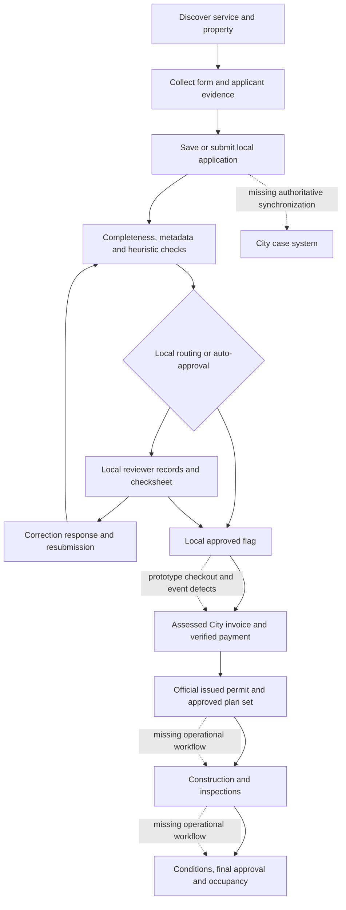

# Portland Permits: what works, what is missing, and what to build next

> **Updated priority, September 9, 2026:** The immediate objective is comprehensive, accurate technical code/zoning checking without waiting for government access. Payment and government-system integration work is deferred. [Read the revised direction](compliance-first.md) and [compliance-first backlog](compliance-backlog.csv); these supersede the development sequencing below. The original audit findings are retained.

**Audit date:** September 9, 2026. **Target:** [portlandpermits.org](https://www.portlandpermits.org). **Baseline:** [`23b4670d8d26b9093f6e401bb89d9d6f30d8506d`](https://github.com/ekrolewicz6/portland-civic-labs/tree/23b4670d8d26b9093f6e401bb89d9d6f30d8506d), deployed May 22, 2026. Production metadata and the repository baseline match. This audit changed no application code and performed no production submissions, uploads, payments, record changes, or notifications.

## Executive assessment

**The app is a substantial permitting prototype with a working public front door, reusable forms, and a partially functioning local case-management system. It is not yet a permitting department operating system, and it cannot currently complete an authoritative City permit from application through issuance or closeout.**

Its useful accomplishments are real: it brings discovery, property-oriented guidance, fee estimates, timeline explanations, form collection, saved applications, status history, checksheets, discipline records, and applicant/staff screens into one interface. Original server functions can persist synthetic submissions and create review records. This is considerably more than a visual mockup. But the application record belongs to this app; the source does not connect it to the City’s issuing, finance, inspection, or final-occupancy records. A local `approved` or `issued` status therefore does not establish that the applicant has legal permission to do the work. [C03](https://github.com/ekrolewicz6/portland-civic-labs/blob/23b4670d8d26b9093f6e401bb89d9d6f30d8506d/src/actions/applications.ts#L210) [C11](https://github.com/ekrolewicz6/portland-civic-labs/blob/23b4670d8d26b9093f6e401bb89d9d6f30d8506d/src/actions/pipeline.ts#L36) [C22](https://github.com/ekrolewicz6/portland-civic-labs/blob/23b4670d8d26b9093f6e401bb89d9d6f30d8506d/src/lib/db/schema.ts#L171) [O03](https://www.portland.gov/ppd/development-permit-processes/step-4-getting-your-permit)

The most consequential findings are:

1. **The six automatic-approval paths are not reliable eligibility decisions.** Some adverse trade, fence, FIR and solar cases pass because of missing eligibility checks, mismatched field names, unchecked attestations, or defaults. Solar’s normal form also cannot supply the document keys the pipeline expects. The full set is detailed below, with reproducible isolated tests.
2. **The application/document contract is broken across much of the catalog.** There are 180 entries, not 175. Of 119 forms with upload fields, 105 reproduce a mismatch between the uploader’s objects and the validator’s expected string IDs. Eight parks schemas throw when incompatible conditional expressions are evaluated. These are concrete defects, not estimates of applicant failure rates.
3. **Approvals, changes and payments do not form a dependable state machine.** An approved application can be edited without losing approval. A last reviewer can approve despite unresolved blockers. A nonexistent review can produce approval when no review rows exist. Checkout trusts a caller-supplied amount; the normal modeled Stripe event sequence leaves an approved application paid but not issued, while another event path can issue an unreviewed draft.
4. **Real adoption requires security and operating controls first.** The pipeline action and printable-application endpoint lack their own authorization checks. Development personas are accepted unless explicitly disabled. Upload/download access is insufficiently scoped. These are source/isolated-test findings; the audit did not attempt to access other users’ production records or exploit the deployment.
5. **The largest likely benefit is shared processing work across many permit types.** Reliable intake, corrections, fee/issuance handoffs, and inspection administration can reach more work than adding additional auto-approval labels. The exact ranking by annual hours remains provisional because no staff-time study or current per-path volume extract was available.

**Recommendation:** first make a narrow workflow correct, secure, revision-aware and connected to official records. In parallel, measure the existing DevHub baseline. Pilot one already-authorized no-plan-review trade class, then expand shared intake/corrections and issuance across building permits, and connect inspection administration. Do not begin by expanding the catalog or promising autonomous approval of complex buildings.

This is not a recommendation to discard the app. Its interface and reusable infrastructure are a useful starting point. The investment now needed is in the contracts and operating workflow behind those screens.

### Tomorrow, with an actual department

| Scenario | What is usable | What cannot be counted as accomplished | Quantified conclusion |
|---|---|---|---|
| **As deployed** | Public discovery/guidance screens; form previews; a demo of applicant and reviewer concepts. Source and isolated tests demonstrate local persistence and some review mechanics. | Official submission, assessed City payment, valid permit issuance, inspections, final approval, occupancy, or completion of outside-agency services. | **0 demonstrated authoritative zero-touch completions.** Staff-effort and elapsed-time savings are **unknown**, not established as zero and not established as 50–100%. |
| **Department adoption tomorrow, current code plus authorized configuration** | Supervised comparison with staff decisions; staff usability testing; guidance after content verification. Existing local case screens could support a controlled evaluation. | Configuration does not fix eligibility, upload, authorization, revision, payment or records defects. Staff must still use authoritative systems and perform reviews/inspections. | **0 end-to-end official completions through this app alone.** Duplicate entry could consume rather than save time. A real sensitive-data intake pilot should wait for the prerequisite fixes. |
| **Software-only completion under unchanged policy** | Extensive processing automation; potentially zero-touch issuance for a precisely bounded existing eligible class; objective rule checks; reliable records, finance, notices and scheduling integrations. | Physical construction, field inspections, professional factual attestations, discretionary decisions, hearings and legally required waiting opportunities. | Conditional labor models range from **80–100% of issuance effort for a clean no-review class** to **10–25% for a discretionary case**. These are transparent planning scenarios, not measured forecasts. Whole-lifecycle percentages are lower. |

“Turned on tomorrow” is not equivalent to “all the needed APIs and rule packs have been built.” City integration is legitimate future software work in this assessment; it is listed explicitly rather than credited to the current app.

### How to use the deliverables

- [Catalog matrix](catalog-matrix.csv): all **180 entries**, each with scope/authority, actual workflow, current stop point, remaining work, three scenarios, both endpoints, automation uncertainty, implementation needs and sources.
- [Automation paths](automation-paths.csv): **47 distinct paths** for the families where broad labels would hide different eligibility rules.
- [Rules coverage](rules-coverage.csv), [integration gaps](integration-gaps.csv), [claim verdicts](claims-verdicts.csv), and [engineering backlog](engineering-backlog.csv).
- [Effort models](effort-models.csv) and [impact sensitivity](impact-sensitivity.csv): explicit assumptions and arithmetic, separated from observed counts.
- [Sources](sources.md), [reproducible tests](evidence/run-audit.cjs), [test results](test-results.csv), [catalog verification](evidence/catalog-verification.json), and [verification notes](verification.md).

## Evidence and meaning of “automated”

### Evidence classes

**Demonstrated** means an observed public production interaction or a reproduced isolated operation; the report identifies which. **Implemented but unverified** means code exists but live configuration or an end-to-end result was not verified. **Partial** means an important component exists but cannot complete its named responsibility. **Simulated** means a template, heuristic, mock or demonstration stands in for a substantive result. **Missing** means the necessary operating mechanism was not found in the inspected code. **Externally dependent** means another authority, system, professional or physical event must provide the outcome.

A successful synthetic test demonstrates implementation behavior. It does not establish legal accuracy, live database durability, payment settlement, authorization by the City, or real-world workload savings. The isolated harness invokes original code, with an in-memory PostgreSQL-compatible database, synthetic identities, disabled network and notifications, and a Stripe contract mock. The public browser inspection is read-only. Production configuration and runtime logs were not fully accessible, so the report does not pretend to know which private services are currently connected.

The result is **69 recorded scenarios: 34 confirm gaps and 35 are controls or successful operations within their stated scope**. This is an intentionally adversarial suite, not a statistical sample; 34/69 is not a production error rate. The catalog was separately inventoried and exercised with generated fixtures. [C01](https://github.com/ekrolewicz6/portland-civic-labs/blob/23b4670d8d26b9093f6e401bb89d9d6f30d8506d/src/lib/form-engine/loader.ts#L2302)

### The three measures

1. **Staff-effort reduction** = `(baseline staff minutes − future staff minutes) / baseline staff minutes`. Include the staff actually required by the endpoint. Count inspector time for a full-lifecycle estimate. Applicant design and construction effort are reported separately, not secretly removed from the denominator.
2. **Zero-touch case share** = `cases completing the defined endpoint without staff intervention / cases in the stated cohort`. A required staff inspection makes that case non-zero-touch through full closeout. A narrow prequalified class can have 100% automated issuance while representing a small, unknown share of the whole portfolio.
3. **Elapsed-time reduction** compares matched case durations. Separate staff queues, active processing, applicant corrections/payment delays, external approvals, and statutory clocks. Running a check in 10 milliseconds does not remove weeks of unrelated waiting.

The app’s counters for rules passed, pipeline stages and forms do not supply any of these denominators. No current “80% automated department” figure is defensible from the code alone.

### What 0%, 25%, 50%, 80% and 100% can honestly mean

| Band | A defensible interpretation | What it does not mean |
|---|---|---|
| **0%** | No authoritative endpoint completion is demonstrated; a legally required human decision/inspection still prevents a zero-touch case. | That the interface provides no value or cannot reduce some clerical work. |
| **25%** | In a specified time budget, automation removes roughly one quarter of staff minutes, such as record assembly and routine checks in a complex review. | One quarter of the City’s legal obligations have been fulfilled by the app. |
| **50%** | A balanced routine workflow could lose about half its manual handling when repeated entry, checking and corrections are automated. | Half of all permits could be issued without review. |
| **80%** | Most processing work in a tightly bounded administrative class can be automated, while exceptions and some verification remain. | An 80% correct decision system is acceptable for auto-issuance. Decision accuracy and labor reduction are different measures. |
| **100%** | An exact eligible class reaches a specified endpoint with no staff touch, using complete verified inputs and the authorized issuing system. A candidate is a permitted no-plan-review trade purchase already allowed by existing policy. | Every trade, every project stage, field inspections, truthful applicant declarations, construction, or every application submitted. |

For an automatic rule check, the software may execute 100% of that check. This says nothing about the completeness of the rule set. For a permit-exempt project, the useful endpoint is a correct explanation of exemption and remaining obligations; issuing an unnecessary “permit” is not an automation win.

## What the application currently does from end to end

### Workflow map

The solid arrows describe the intended sequence, not a claim that all stages work. The app has substantial components through local review; its authoritative financial, issuance and closeout connections are missing or incomplete.

### Capability-by-capability assessment

| Capability | Classification and actual implementation | Where it stops |
|---|---|---|
| Service discovery | **Demonstrated publicly.** Searchable catalog, categories and form entry points. | Broad/overlapping labels do not determine a complete, correct permit bundle or authority. Some catalog content is stale. |
| Property/jurisdiction | **Implemented/partial.** Public address/geocoding and ArcGIS request code; property/history surfaces. The tested public City-building address returned “Address not found.” | A successful live lookup was not demonstrated. One failed address does not establish universal failure. An address point also is not verified parcel geometry, legal-lot status, current conditions or complete jurisdiction. |
| Zoning and hazards | **Partial.** Standalone standards and overlay information exist. | The submission pipeline does not reliably consume that evidence; missing overlay responses can look clear, and missing numeric facts can count as passes. |
| Conditional forms/autofill | **Implemented/partial.** Reusable schema-driven wizard, contact/address fields, draft resume. | Client/server contracts diverge; condition shapes are inconsistent; metadata completeness is not design completeness. |
| Signatures | **Partial.** Typed legal-name input and string validation. | No demonstrated signer-authority verification, signed immutable revision or professional-seal verification. A typed signature is not inherently invalid; its workflow and evidentiary binding are missing. |
| Attachments | **Partial.** Upload UI and storage paths; document/application linking. | Uploader/Zod mismatch, absent expected document keys, weak upload proof and access controls. No substantive plan validation. |
| Submission and saved applications | **Demonstrated in isolation.** Original actions create/update records and histories; owner scoping protects some operations. | No official City intake acknowledgement. Repeated operations are not consistently idempotent. Saving over an approved application does not invalidate the decision. |
| Completeness | **Partial.** Required-field and document-key checks produce findings. | False certifications and invalid types can pass the server path; incomplete cases can sit in review without a responsible queue. |
| Automatic review | **Partial and unsafe for issuance.** Six-slug allowlist plus small rule set. | Does not enforce all actual eligibility requirements; field names and defaults change outcomes. |
| AI pre-review | **Simulated/heuristic in the pipeline.** Deterministic template findings. Separate optional Anthropic advisor exists. | No demonstrated drawing interpretation, plan completeness, engineering analysis or AI-derived approval evidence. |
| Assignment/parallel review | **Partial; demonstrated in isolation for selected families.** Discipline rows, statuses and reviewer controls. | Most slugs lack default routes; required-review set is not a complete, revision-bound dependency graph; some staff screens and actions accept inconsistent role sets. |
| Corrections/amendments | **Partial.** Checksheet items, message response and snapshots exist. | Response text does not replace a plan set. Resume only loads drafts. Resubmission duplicates reviews/documents and does not reliably invalidate/resolve earlier decisions. |
| Cross-bureau coordination | **Partial.** Groups local applications by normalized address; child trade drafts can be generated. | It does not synchronize bureau approvals. Text-address grouping of a limited local result set is not a comprehensive project graph. |
| Fee estimates | **Implemented estimate, not assessment.** Building/trade/SDC calculations. | Old fee version, classification/exemption gaps and no authoritative persisted invoice connected to checkout. |
| Payment/reconciliation | **Implemented but live service unverified; defects reproduced with contract mock.** Stripe checkout/webhook code and payment records. | Amount is caller-controlled; correlation, replay and out-of-order handling are incomplete; no City finance reconciliation. |
| Official issuance | **Missing as an authoritative result.** Local status transitions and printable HTML application. | No verified official permit ID/record, authorized release, stamped approved plans, enforceable conditions or City inspection card. |
| Notifications | **Partial.** In-app notification records and status messaging. | No demonstrated email/SMS delivery, durable retry/receipt, or legally sufficient notice service. |
| Inspection/reinspection | **Missing operating workflow.** Guidance and generic status fields do not provide visit scheduling/results. | No inspector-capacity integration, signed field results, failed inspection/reinspection or special-test dependency management. |
| Expiration/extensions/appeals/final/occupancy | **Mostly missing operating workflow.** Generic expiry fields, appeal forms and final-like statuses. | No complete legal-clock, extension decision, appeal record/finality, occupancy certificate, or condition/recapture process. |
| Reliability/audit/recovery | **Partial.** Histories, logs and snapshots are useful primitives. | No demonstrated transactional workflow, durable event handling, full tamper-evident decision record, recovery/reconciliation or production restore proof. |

Implementation evidence: [C02](https://github.com/ekrolewicz6/portland-civic-labs/blob/23b4670d8d26b9093f6e401bb89d9d6f30d8506d/src/app/%28public%29/apply/%5Bslug%5D/client.tsx#L61) [C03](https://github.com/ekrolewicz6/portland-civic-labs/blob/23b4670d8d26b9093f6e401bb89d9d6f30d8506d/src/actions/applications.ts#L210) [C04](https://github.com/ekrolewicz6/portland-civic-labs/blob/23b4670d8d26b9093f6e401bb89d9d6f30d8506d/src/lib/form-engine/schema-to-zod.ts#L80) [C05](https://github.com/ekrolewicz6/portland-civic-labs/blob/23b4670d8d26b9093f6e401bb89d9d6f30d8506d/src/components/forms/field-renderer.tsx#L521) [C06](https://github.com/ekrolewicz6/portland-civic-labs/blob/23b4670d8d26b9093f6e401bb89d9d6f30d8506d/src/lib/review-pipeline/stages/completeness.ts#L26) [C07](https://github.com/ekrolewicz6/portland-civic-labs/blob/23b4670d8d26b9093f6e401bb89d9d6f30d8506d/src/lib/review-pipeline/stages/document-validation.ts#L68) [C10](https://github.com/ekrolewicz6/portland-civic-labs/blob/23b4670d8d26b9093f6e401bb89d9d6f30d8506d/src/lib/review-pipeline/disciplines.ts#L12) [C11](https://github.com/ekrolewicz6/portland-civic-labs/blob/23b4670d8d26b9093f6e401bb89d9d6f30d8506d/src/actions/pipeline.ts#L36) [C13](https://github.com/ekrolewicz6/portland-civic-labs/blob/23b4670d8d26b9093f6e401bb89d9d6f30d8506d/src/actions/discipline-review.ts#L64) [C14](https://github.com/ekrolewicz6/portland-civic-labs/blob/23b4670d8d26b9093f6e401bb89d9d6f30d8506d/src/actions/payments.ts#L33) [C15](https://github.com/ekrolewicz6/portland-civic-labs/blob/23b4670d8d26b9093f6e401bb89d9d6f30d8506d/src/app/api/webhooks/stripe/route.ts#L13) [C16](https://github.com/ekrolewicz6/portland-civic-labs/blob/23b4670d8d26b9093f6e401bb89d9d6f30d8506d/src/app/api/applications/%5Bid%5D/pdf/route.ts#L14) [C21](https://github.com/ekrolewicz6/portland-civic-labs/blob/23b4670d8d26b9093f6e401bb89d9d6f30d8506d/src/lib/db/index.ts#L8) [C22](https://github.com/ekrolewicz6/portland-civic-labs/blob/23b4670d8d26b9093f6e401bb89d9d6f30d8506d/src/lib/db/schema.ts#L171) [C23](https://github.com/ekrolewicz6/portland-civic-labs/blob/23b4670d8d26b9093f6e401bb89d9d6f30d8506d/src/actions/zoning.ts#L23) [C24](https://github.com/ekrolewicz6/portland-civic-labs/blob/23b4670d8d26b9093f6e401bb89d9d6f30d8506d/src/lib/zoning/gis-client.ts#L155) [C27](https://github.com/ekrolewicz6/portland-civic-labs/blob/23b4670d8d26b9093f6e401bb89d9d6f30d8506d/src/lib/review-pipeline/stages/ai-pre-review.ts#L40) [C28](https://github.com/ekrolewicz6/portland-civic-labs/blob/23b4670d8d26b9093f6e401bb89d9d6f30d8506d/src/lib/ai/routing.ts#L45) [C29](https://github.com/ekrolewicz6/portland-civic-labs/blob/23b4670d8d26b9093f6e401bb89d9d6f30d8506d/src/lib/notifications/triggers.ts#L78) [C30](https://github.com/ekrolewicz6/portland-civic-labs/blob/23b4670d8d26b9093f6e401bb89d9d6f30d8506d/src/actions/coordination.ts#L66) [C31](https://github.com/ekrolewicz6/portland-civic-labs/blob/23b4670d8d26b9093f6e401bb89d9d6f30d8506d/src/actions/bundling.ts#L135) [C32](https://github.com/ekrolewicz6/portland-civic-labs/blob/23b4670d8d26b9093f6e401bb89d9d6f30d8506d/src/components/applications/correction-panel.tsx#L65) [C33](https://github.com/ekrolewicz6/portland-civic-labs/blob/23b4670d8d26b9093f6e401bb89d9d6f30d8506d/src/app/%28public%29/apply/%5Bslug%5D/page.tsx#L33).

### The six auto-approval paths: actual verdicts

| Path | What the code checks | What isolated tests demonstrate | Operational verdict |
|---|---|---|---|
| Electrical | Generic stage success, blockers, membership in the auto-approval set. | A synthetic complete form approves. Invented contractor credentials and false certifications do not prevent server-path approval. | Does not establish eligibility for the City’s no-plan-review purchase route. Needs scope and credential verification. |
| Mechanical | Same generic trade path. | Commercial hood-work selection still approves. Exact lawful plan requirements depend on scope, but the engine does not classify them. | Split equipment/minor work from plan-required mechanical design. Apply current exceptions explicitly. |
| Plumbing | Same generic trade path. | Commercial medical-gas scope approves. | Clear failure to keep plan-required work out of the instant route. |
| Fence | Material/height thresholds; selected exclusions. | UI uses `fenceType`, engine uses `fenceMaterial` and defaults to wood. Six-foot masonry, front-yard/corner and historic/overlay answers can approve. Internal threshold tests work when fed the engine’s preferred keys. | Correct threshold code is not enough when the UI supplies different facts. Many low fences are building-permit-exempt rather than auto-issuable. |
| FIR | A $50,000 valuation criterion and nonstructural assumption. | UI `estimatedCost: 500000` does not populate engine `estimatedValuation`; false registration/nonstructural attestations do not stop approval. | Neither actual FIR membership nor field-review eligibility is established. The $50,000 logic is not evidence of authority to issue. |
| Solar | A 25 kW threshold and mount-type criterion plus required documents. | Normal form cannot satisfy `site_plan` and `electrical_diagram`. When synthetic engine-key documents are provided, actual ground/engineered/commercial selections can approve because field/scope checks are missing. | Two separate defects: ordinary UI path blocked; repaired document input alone would expose unsafe eligibility. Not a claim that the normal live ground-mount form currently auto-issues. |

All six reject entirely empty fixtures at the pure pipeline level. Internal fence, solar and FIR threshold controls also behaved as encoded. These controls are useful: the problem is not that every branch is broken. The problem is that successful internal checks do not establish a correct interpretation of the submitted project. [C08](https://github.com/ekrolewicz6/portland-civic-labs/blob/23b4670d8d26b9093f6e401bb89d9d6f30d8506d/src/lib/review-pipeline/auto-approve.ts#L48) [C06](https://github.com/ekrolewicz6/portland-civic-labs/blob/23b4670d8d26b9093f6e401bb89d9d6f30d8506d/src/lib/review-pipeline/stages/completeness.ts#L26) [C07](https://github.com/ekrolewicz6/portland-civic-labs/blob/23b4670d8d26b9093f6e401bb89d9d6f30d8506d/src/lib/review-pipeline/stages/document-validation.ts#L68) [O05](https://www.portland.gov/ppd/residential-permitting/home-projects/fence-permits) [O06](https://www.portland.gov/ppd/residential-permitting/field-issuance-remodel-program) [O07](https://www.portland.gov/bds/services/solar-permits) [O08](https://www.portland.gov/ppd/commercial-permitting/commercial-permit-inspections/commercial-mechanical-permits) [O09](https://www.portland.gov/ppd/commercial-permitting/commercial-requirements)

The required design is an **explicit eligibility predicate with complete evidence**. Required facts must be `verified clear`, `triggered`, or `unknown`. Missing does not mean false; default zero does not mean a verified measurement; a warning that a review may be required must be resolved before zero-touch issuance.

### Other findings that directly affect decisions

**Zoning checks are not fully wired into submission.** The public lookup returns zoning analysis separately. The pipeline instead searches a cache using an address string; actual form addresses may be objects, and some relevant forms use a different key. The code casts these values rather than normalizing them. It passes zone/overlay arrays but not `developmentStandards`, which the height/FAR/coverage/setback checks require. No write from the public lookup into this cache was found. Even when standards are supplied directly, missing/zero facts can take the passing branch. The correct fix is a parcel- and revision-bound evidence record, not another explanatory paragraph. [C09](https://github.com/ekrolewicz6/portland-civic-labs/blob/23b4670d8d26b9093f6e401bb89d9d6f30d8506d/src/lib/review-pipeline/stages/rules-engine.ts#L39) [C11](https://github.com/ekrolewicz6/portland-civic-labs/blob/23b4670d8d26b9093f6e401bb89d9d6f30d8506d/src/actions/pipeline.ts#L36) [C23](https://github.com/ekrolewicz6/portland-civic-labs/blob/23b4670d8d26b9093f6e401bb89d9d6f30d8506d/src/actions/zoning.ts#L23)

**Known uncertainty can disappear.** The isolated network-outage test produced an empty environmental-zone list and a false design-overlay result. A separate auto-approval test retained overlay warnings while returning no assigned disciplines. Some real overlay situations may qualify for exemptions, but the app has not proven those exemptions. “Data unavailable” and “verified not applicable” need different states. [C10](https://github.com/ekrolewicz6/portland-civic-labs/blob/23b4670d8d26b9093f6e401bb89d9d6f30d8506d/src/lib/review-pipeline/disciplines.ts#L12) [C12](https://github.com/ekrolewicz6/portland-civic-labs/blob/23b4670d8d26b9093f6e401bb89d9d6f30d8506d/src/lib/review-pipeline/pipeline.ts#L68) [C24](https://github.com/ekrolewicz6/portland-civic-labs/blob/23b4670d8d26b9093f6e401bb89d9d6f30d8506d/src/lib/zoning/gis-client.ts#L155)

**Document checks are metadata checks.** The validator accepts a declared PDF with a positive size and the expected key. A one-byte “plan” passed. Zero-byte and wrong-declared-MIME controls failed. That demonstrates limited checking, not a PDF-content parser. There is no testable claim here of detecting omitted dimensions, inconsistent drawings, wrong parcel, inadequate engineering, counterfeit seal, or an unsafe design. [C07](https://github.com/ekrolewicz6/portland-civic-labs/blob/23b4670d8d26b9093f6e401bb89d9d6f30d8506d/src/lib/review-pipeline/stages/document-validation.ts#L68)

**Review completion lacks a unified approval gate.** Pending actual review rows correctly kept one control case in review. But the final completion function does not inspect unresolved checksheet blockers, and an empty review set satisfies `every()`. Another action can jump directly to issued. Each consequential transition must verify the approved revision, required review set, remaining blockers, conditions, financial status and caller authority. [C11](https://github.com/ekrolewicz6/portland-civic-labs/blob/23b4670d8d26b9093f6e401bb89d9d6f30d8506d/src/actions/pipeline.ts#L36) [C13](https://github.com/ekrolewicz6/portland-civic-labs/blob/23b4670d8d26b9093f6e401bb89d9d6f30d8506d/src/actions/discipline-review.ts#L64)

**Deadline tracking is an incomplete operational aid.** The business-day helper skips weekends but does not implement a City holiday calendar or the different start/pause/restart rules for actual legal processes. The stage-advance action updates all deadlines for the application as completed rather than just the relevant stage. Expiration fields and a progress display do not replace escalation ownership, notices, extensions or recovery. [C11](https://github.com/ekrolewicz6/portland-civic-labs/blob/23b4670d8d26b9093f6e401bb89d9d6f30d8506d/src/actions/pipeline.ts#L36) [C37](https://github.com/ekrolewicz6/portland-civic-labs/blob/23b4670d8d26b9093f6e401bb89d9d6f30d8506d/src/lib/review-pipeline/sla.ts#L15)

**Payments are neither an eligibility decision nor an issuance record.** The isolated one-cent checkout test proves caller amount trust; it does not claim Stripe would accept an actual one-cent charge. Session metadata is not also supplied as PaymentIntent metadata. The modeled ordinary sequence on an approved application results in `approved` plus `paid`; a success event with application metadata can instead mark a draft issued. Repeated success adds history, and a later failure can leave `issued` plus `failed`. This requires an invoice and event state machine, not a cosmetic “Paid” badge fix. [C14](https://github.com/ekrolewicz6/portland-civic-labs/blob/23b4670d8d26b9093f6e401bb89d9d6f30d8506d/src/actions/payments.ts#L33) [C15](https://github.com/ekrolewicz6/portland-civic-labs/blob/23b4670d8d26b9093f6e401bb89d9d6f30d8506d/src/app/api/webhooks/stripe/route.ts#L13)

**The rule corpus is not kept current as a controlled product.** The fee estimator identifies July 1, 2025 as its effective date; City schedules are now July 10, 2026. The code applies general seismic/site-suspension messages without the required project/date distinctions. The temporary housing SDC dates even differ between the informational rule message and the fee module. New multifamily is omitted from the fee calculator’s residential classification. ADU eligibility is overbroad and does not operationalize the separate waiver program. Portland’s temporary new-housing exemption also creates a continuing inspection/guarantee obligation, with potential recapture; it cannot be represented solely by setting a fee to zero. [C09](https://github.com/ekrolewicz6/portland-civic-labs/blob/23b4670d8d26b9093f6e401bb89d9d6f30d8506d/src/lib/review-pipeline/stages/rules-engine.ts#L39) [C10](https://github.com/ekrolewicz6/portland-civic-labs/blob/23b4670d8d26b9093f6e401bb89d9d6f30d8506d/src/lib/review-pipeline/disciplines.ts#L12) [C26](https://github.com/ekrolewicz6/portland-civic-labs/blob/23b4670d8d26b9093f6e401bb89d9d6f30d8506d/src/lib/fees/calculator.ts#L42) [O11](https://www.oregon.gov/bcd/codes-stand/Pages/ossc-adoption.aspx) [O12](https://www.portland.gov/code/24/85) [O13](https://www.portland.gov/community-economic-dev/news/2025/9/24/portland-city-council-approves-temporary-code-suspensions-0) [O14](https://www.portland.gov/permitimprovement/code-alignment-project) [O15](https://www.portland.gov/ppd/current-fee-schedules) [O16](https://www.portland.gov/ppd/current-fee-schedules/housing-sdc-exemption)

## Catalog reconciliation and permit-family assessment

### What is in the catalog

The 180 entries consist of **62 in “permits,” 19 businesses, 10 residents, 16 transportation, 5 grants, 4 licenses, 3 loans, 5 rebates, 5 claims, 14 business filings, 12 water/sewer, 8 parks/recreation, 14 reports and 3 updates**. All have corresponding loaded schemas. The advertised count is stale, but the larger count must not be marketed as more end-to-end coverage. [Reconciliation evidence](catalog-reconciliation.csv).

Examples of service overlap include business-tax registration/account registration, Clean River Rewards/stormwater discount, two sewer-loan applications, Treebate/yard-tree-planting wording, and STR/ASTR. Resident/area parking forms overlap in some uses while business programs differ. Broad sign and commercial/residential forms overlap more specialized forms. These are **candidate workflow consolidations**, not assertions that their JSON files are byte-identical.

Supporting artifacts include tree-neighborhood notice certification, development tree plans, and an eligible fire-alarm alteration affidavit. Early assistance, fire-flow information and W-6 fee statements are information or consultation services. A project can require several of these alongside several permits; counting each as a separately completed permit inflates impact.

Only 18 slugs have explicit entries in default discipline routing. Three are intentionally empty trade routes; with empty form facts, **165 entries have no default discipline**, meaning **162 are absent from the mapping**. This does not mean the app automatically approves 165 entries: most simply reach a generic review state without a useful default assignment. The sewer UC journey reproduced that problem. [C10](https://github.com/ekrolewicz6/portland-civic-labs/blob/23b4670d8d26b9093f6e401bb89d9d6f30d8506d/src/lib/review-pipeline/disciplines.ts#L12)

### 1. Electrical, mechanical and plumbing

**What is solved today:** the app can collect basic project/contractor information, save a local record, run generic checks and mark selected trade slugs approved. The same form can expose commercial or specialized work that has no corresponding eligibility classifier. Separate commercial electrical/mechanical slugs also exist but do not inherit the same automatic path merely because their name describes a trade.

**What remains:** determine whether the work qualifies for a no-plan-review purchase; verify the applicant’s permitted role and current license class; calculate the exact assessment; create the official trade permit; link installation, inspection, failed inspection and final results. Plan-required work needs its actual drawings and technical review. Portland already provides eligible no-review purchasing through DevHub, so recreating online checkout is not, by itself, a new 11-day saving. [O01](https://www.portland.gov/ppd/devhub-faqs) [O02](https://www.portland.gov/ppd/submit-and-pay-application-permit-type)

**Future software-only potential:** for a City-accepted existing no-review class with verified scope, applicant, property, fee and payment, **100% zero-touch issuance is a plausible design endpoint**. Do not extrapolate to the fraction of all trade cases: that fraction is unknown. Model M1 assumes 30 baseline staff minutes and 24–30 removed; after including 60 minutes of later staff work, total reduction is 30–44%. If DevHub already removes most of those 30 minutes, the incremental benefit of this app can be much smaller. Plan-required trade work instead follows M2/M3, with review and inspections retained.

**Build next:** one exact eligible electrical/fixture/equipment path, validated exclusions, CCB/BCD verification, current fees, official issuing adapter and inspection linkage. Commercial medical gas must route out. Mechanical exceptions must use the current scope-specific rules, including relevant July 2026 changes, rather than “commercial” as one binary answer. [O08](https://www.portland.gov/ppd/commercial-permitting/commercial-permit-inspections/commercial-mechanical-permits) [O09](https://www.portland.gov/ppd/commercial-permitting/commercial-requirements)

### 2. Fences and other small residential projects

**Fences need two products:** a correct permit-needed determination and, where needed, an application/issuance workflow. Portland’s material/height exemptions and pool-barrier requirements make that distinction material; zoning and sight-line constraints can remain even when no building permit is needed. The current engine merges these concepts and does not consistently read the actual material/location answers. [O05](https://www.portland.gov/ppd/residential-permitting/home-projects/fence-permits)

With verified geometry, materials and site evidence, much of fence screening can be deterministic. For a permitted structural/pool/site case, drawings, engineering where applicable and inspection still matter. M2 is an illustrative processing budget; **no observed fence labor-reduction or zero-touch share is available**. A compliant exempt fence should not increase “permits issued.”

Decks, retaining walls, stairs, reroofing and storm repairs similarly require exemption-versus-permit splits. Height alone is insufficient: attachment, loading/surcharge, slope, structural alteration, material changes, existing conditions and occupancy can change the path. Today these are mostly specialized intake forms attached to generic processing, with limited specific routing. Future work should encode the exact exemption and prescriptive classes, require structured dimensions/loads/site evidence, and connect approved work to inspections. Complex/site cases follow M3 rather than a blanket “simple permit” percentage.

### 3. Solar

**Today:** the application asks useful system questions, but has no normal upload path for the required engine documents. Repairing this is necessary but not sufficient: the mount and review-path mismatches must also be fixed. A positive 25 kW boundary test proves only that this internal threshold works.

**Actual lifecycle:** classify prescriptive versus engineered roof/site design; obtain the required structural assessment and plans; coordinate electrical permitting; assess fees and issue; install and pass the applicable inspections. Utility/interconnection requirements are an additional dependency outside a building department’s sole control. Portland’s guidance provides a prescriptive route, not evidence that every system under the app’s threshold can bypass all review. [O07](https://www.portland.gov/bds/services/solar-permits)

**Future:** structured roof/system inputs and a validated prescriptive rule pack can remove repeated checking and handling. Start with M2 for a routine completed packet; use M3 for engineered, ground-mounted or exceptional cases. A claimed 80% saving would require proving that repeatable tasks account for that much of the actual baseline. No full-lifecycle zero-touch claim survives required field verification. Build signed/revision-bound worksheets, structural exclusions, electrical linkage and clear unknown handling before considering automatic issuance.

### 4. FIR

FIR is a department operating model involving enrolled participants and inspectors, not just a lower-dollar remodel form. The City page describes closure to new entrants as of March 2026. Existing participants can still be the relevant cohort, but membership, scope acceptance and inspector work must be verified. [O06](https://www.portland.gov/ppd/residential-permitting/field-issuance-remodel-program)

The current app’s cost/structural/attestation defects make its approval flag unsuitable for that decision. Future software can support recurring contractor records, consultation scheduling, scope changes, fee preparation and field records. It cannot replace the field role that defines the program. Use M3 as a transparent workflow budget, not M1’s no-review assumptions. **100% zero-touch issuance is not the appropriate target where an inspector must first assess the project.** The pilot question is minutes and handoffs saved per FIR case, not how many can be labeled instant.

### 5. ADUs, additions, conversions and new residential construction

The app has meaningful dedicated forms and reviewer shells here. Isolated original submissions produced four review records for the ADU fixture and seven for the residential fixture. These counts are outcomes for those generated inputs, not a correct required-review specification for every ADU or house. The ADU form lists required documents as descriptive text but provides no upload fields; key mismatch also affects residential plans. Draft/correction navigation and approval invalidation require repairs.

Separate at least these paths:

- **Detached new ADU:** site, zoning, building design, utilities and new structure; separate ADU waiver eligibility and continuing conditions.
- **Attached or conversion ADU:** the above plus existing-building legality, habitable-space conversion and unit separation/utility issues.
- **Conversion without a new dwelling:** habitable-space requirements without automatically inheriting ADU or new-unit financial treatment.
- **Addition:** changed building/site dimensions and possibly new dwelling units; different applicability of temporary code relief.
- **Interior alteration:** potentially narrower site scope; not automatically exempt from every tree, frontage, fire or existing-condition obligation.
- **New detached/townhouse/accessory construction:** correct specialty-code applicability, full design/site conditions and staged field approval.

Portland’s ADU process retains construction permits and inspections. The 2025 OSSC is mandatory for applicable commercial construction provisions from April 1, 2026; that does not make it the correct code for every small residential project. Each decision needs the appropriate specialty-code edition, adoption/amendment dates, project class and vesting rule. [O10](https://www.portland.gov/ppd/residential-permitting/home-projects/accessory-dwelling-units) [O11](https://www.oregon.gov/bcd/codes-stand/Pages/ossc-adoption.aspx)

**Future software work:** canonical parcel/project model; geometrically verified site plans; explicit use/unit/area facts; objective structural/energy/life-safety checks where inputs support them; required review and trade dependencies; professional approvals; versioned corrections; current fees; official plan set and inspections. A library of accepted standard designs can reduce repeated design review, but site suitability and constructed conformity remain separate.

M3 illustrates **25–50% issuance staff reduction and 15–33% full-lifecycle staff reduction**, conditional on its stated budget. A tightly standardized, low-complexity subcase could resemble M2; an unusual site or discretionary approval can resemble M4. The distribution is unknown. There is no evidence for a single 56% elapsed-time saving across new homes or a current automatic ADU permit.

### 6. Commercial buildings, tenant improvements, occupancy changes and multifamily

The commercial and TI fixtures create local review rows, but the app has not implemented comprehensive plan checking or authoritative multi-bureau release. The commercial document mismatch and common workflow defects apply. Its metadata checks cannot establish structural adequacy, fire-resistance details, exits, accessibility, energy performance, hazardous-use classification, or design coordination.

**Simple TI** can be comparatively repeatable if it truly leaves occupancy, structure, significant systems and unusual hazards unchanged. **Complex TI or change of occupancy** may trigger much broader review. **New commercial and multifamily/mixed-use** require professional design, site/infrastructure coordination, specialty permits and acceptance/occupancy processes. Separate trade review remains important. The temporary code changes are scoped; broad “site upgrades paused” or “seismic evaluation suspended” statements cannot substitute for applicability checks. [O09](https://www.portland.gov/ppd/commercial-permitting/commercial-requirements) [O12](https://www.portland.gov/code/24/85) [O14](https://www.portland.gov/permitimprovement/code-alignment-project)

Future software can make a complete submission understandable, compare repeated details, check objective dimensions/calculations and expose dependencies. It needs structured plan facts, assembly/equipment libraries, provenance, professional review and a dependable condition graph. Use M2/M3 for a demonstrably simple TI, M3/M4 for more complex TI and M4 as an illustrative complex-building budget. **Do not promise zero-touch complex-building approval or an automatic certificate of occupancy.** Final inspections, special tests and approvals remain genuine work, even when their scheduling and recording are automated.

### 7. Demolition

The demolition form and basic discipline assignment are implemented. They do not implement the full sequence of notices, delay/extension rules, historic/deconstruction classification, environmental/utility clearances and site restoration. The isolated demolition fixture created two review records; that is not proof of a complete required-review set.

Qualifying residential demolitions can have a 35-day delay and additional applicable processes; other projects or documented exceptions follow different paths. Deconstruction, hazardous-material handling, notifications and physical site work cannot be removed by issuing a status. Replacement-building sequencing also matters. [O19](https://www.portland.gov/ppd/residential-permitting/home-projects/residential-demolition-permits) [O20](https://www.portland.gov/ppd/codes-rules-and-guides/bod-24-02-demolition)

The best software opportunity is deterministic classification, correct recipients, complete packets, service evidence, clocks, clearances and replacement-project dependency tracking. M3 illustrates administrative/review assistance. Statutory waiting time is a retained constraint, not an engineering backlog item to “optimize away.” Zero-touch full closeout remains incompatible with required field and agency work.

### 8. Land use, appeals and discretionary decisions

The app can collect a general land-use application and create local review rows. It does not implement the full administrative record, service of notice, hearing, standing, appeal/finality or condition-enforcement process. An appeal form is not an appeal-management system.

Split objective criteria from discretionary findings, and split review types by actual notice/hearing/appeal requirements. Not every review has a hearing, but lack of a hearing does not mean there is no required notice or appeal opportunity. Software can automate completeness, geographic mailing lists, exhibits, calculations, schedules and drafting assistance; it cannot replace legally required judgment with a generic “all rules passed” flag. [O17](https://www.portland.gov/bds/article/204690) [O18](https://www.portland.gov/bds/documents/type-ii-land-use-review-procedure/download)

M4’s **10–25% issuance/decision effort reduction** is an illustrative budget for record/administrative assistance; it does not forecast the percentage of cases won, approved or completed without staff. Objective administrative subpaths could support more automation after a detailed rule audit. For cases requiring an independent human merits decision, **zero-touch case share is 0% under unchanged policy**, even if every clerical step is automated. Notice and appeal periods can run automatically but still consume elapsed time.

### 9. Trees

The catalog is broad: street/private pruning, removal, heritage work, root pruning, attachments, chemicals, ornamental lights, development plans, programmatic work, replanting waivers, notice certification, appeals and early assistance. Only basic removal has a specific default tree route. The other entries do not constitute a complete Title 11 operating system.

The meaningful splits are exempt work, limited routine pruning, objective Type A cases, discretionary Type B/heritage/waiver cases, and tree work embedded in development. Ownership/location, species, diameter, protected status, prior decisions and replanting conditions change the result. A general removal form cannot establish all these facts. Proposed 2026 tree-code changes were not treated as enacted requirements in this audit. [O21](https://www.portland.gov/ppd/tree-permits/do-i-need-tree-permit) [O22](https://www.portland.gov/code/11/40) [O23](https://www.portland.gov/ppd/tree-permits/removal-and-replanting-permits/do-i-need-permit-remove-trees-private-property) [O24](https://www.portland.gov/trees/treepermits/documents/street-tree-permit-application-non-removal/download)

For routine objective classes, software can perform much of the clerical validation and screening once factual evidence is trustworthy. M2 is a useful scenario; M3/M4 fit site inspection and discretionary classes. Arborist assessment, hazards, physical tree work and replacement establishment remain. A replanting waiver is a discretionary exception, not an omitted checkbox. Full-lifecycle automation must include condition compliance, not stop at permission to remove.

### 10. Fire systems and operating/event permits

New/major fire alarm and sprinkler systems need a different workflow from eligible minor modifications and affidavits. Operating permits for public assembly, tents, propane, hot work, pyrotechnics, lasers, bonfires and performers need separate scope/credential/site criteria. The catalog mostly collects these requests; only the general fire-code slug has a specific default fire route.

Future software can validate equipment/credentials, structure safety plans, compute objective capacities/separations where adequate facts exist, schedule inspections and track renewals. System design and physical acceptance tests are not accomplished by document presence. Events can require inspection, officer judgment or staffing before approval. M2 can describe an explicitly accepted minor/recurring administrative class; M3 fits more substantive review. **No blanket 100% fire-permit automation claim is supported.** [O28](https://www.portland.gov/fire/permits-inspections/public-assembly-permit-requirements) [O29](https://www.portland.gov/fire/permits-inspections/documents/30008an-annual-permit-public-special-events-0/download) [O30](https://www.portland.gov/fire/permits-inspections/documents/design-manual-fire-protection-systems-and-processes/download)

The source manual is used here to establish that design and field-test stages exist, not as a substitute for current code-edition-specific numerical design criteria. Those rule packs are still future work.

### 11. Signs and awnings

The app has a broad sign form plus permanent, temporary, portable and fabric-awning entries. These overlap. **Portable registration is obsolete as of July 25, 2026**, although placement/size compliance continues. Permanent signs/awnings and applicable temporary registrations are different products. [O31](https://www.portland.gov/ppd/sign-permits) [O32](https://www.portland.gov/transportation/permitting/portable-signs-boards)

For permanent work, software needs the existing/proposed sign inventory, façade and location measurements, structural attachments, illumination/electrical linkage and prior land-use conditions. Text descriptions alone do not establish those facts. Standard flush-mounted cases could approach M2; engineered/projection/historic cases need more review. Required installation/final inspection remains. Retire the obsolete portable application and make the remaining rule path explicit before expanding automation.

### 12. Transportation and right-of-way

Separate parking-only temporary use, storage containers, sidewalk/lane closures, public events, encroachments, driveway construction, bike-rack projects and oversize-load routes. Annual/resident/income-qualified parking entitlements are another administrative family. The present forms do not reserve curb capacity or create official PBOT permissions/work orders.

Software can automate much of a simple space/time application **only with current inventory and conflict data**, exact geometry and accepted access/safety rules. Portland’s current TSUP guidance includes live transportation restrictions; a static historical rule set cannot know them. Engineered traffic control, accessible pedestrian routing, transit/emergency access, insurance/bonds and restoration introduce further review and field duties. [O25](https://www.portland.gov/transportation/permitting/temporary-street-use-permitting-tsup) [O26](https://www.portland.gov/transportation/permitting/apply-renew-or-change-temporary-street-use-permit) [O27](https://www.portland.gov/transportation/permitting/encroachment-permits)

M2 illustrates a clean routine class; M3 covers site/traffic engineering. Actual zero-touch share and incremental delay saved are unknown. Queue assignment and calendar integration may help more than attempts to automate traffic-engineer judgment. A utility-locate request still needs the locate center/utility owners and physical markings; it is not excavation clearance.

### 13. Water, sewer, stormwater and septic

The UC/UR forms, meter requests, backflow, fire-flow/W-6 information, hydrant/sewer access and discharge applications cover very different endpoints. The isolated UC submission reached review with **zero default review rows**. No implemented external case adapter completes the actual request.

For sewer work, separate private plumbing from public ROW connection/repair and broader public works. The existing UC process includes insurance/bonds, City payment/release handoffs and PBOT inspections. This is a concrete place where better software could remove repeated paperwork and payment-notification handling while retaining required technical/field controls. Meter work adds capacity/design, physical installation and billing/asset activation. [O33](https://www.portland.gov/ppd/infrastructure/ur-and-uc-permits) [O34](https://www.portland.gov/ppd/infrastructure/ur-and-uc-permits/uc-permit) [O35](https://www.portland.gov/ppd/infrastructure/sewer-stormwater-permit-requirements)

Use M3 for a bounded infrastructure workflow, measuring administrative minutes separately from installation and inspections. Fire-flow information and a fee statement are useful earlier responses, not permission to connect. Industrial discharge/NPDES and onsite septic require their actual program/authority rules; construction stormwater 1200-C does not stand in for every industrial permit. The audit gives these an **unknown numerical potential** until the agency-specific rule and interface work is done. [O36](https://www.oregon.gov/deq/wq/Documents/1200CPermit.pdf)

### 14. STR, home occupations and regulated businesses

STR and ASTR entries overlap. Type A and Type B are the significant distinction, along with residency/legal bedrooms and other site conditions. The specific ASTR administrative rule provides self-certification and sampled preissuance inspections for Type A; broader service guidance discusses inspections. A production rule pack must reconcile the bureau’s current application of those sources. **The 10% inspection sample is not evidence that the other 90% currently have zero staff work.** Type B retains conditional-use review. [O37](https://www.portland.gov/bds/astr-permits/before-you-apply) [O38](https://www.portland.gov/policies/environment-built/permitting-development-administrative-policies-procedures/enb-1302)

Home occupations need a Type A/no-permit versus Type B split. Automated exemption guidance and a properly bounded Type B workflow are useful; a universal “home business permit” is not. [O39](https://www.portland.gov/ppd/home-occupation-permit)

Food carts/pods, cannabis, liquor, alarms, secondhand dealing and other regulated businesses each need their owning agency’s rule/record system. Food cart health licensing belongs to Multnomah County; state licensing remains relevant for cannabis/liquor, and the City’s recommendation is not the state license. Their city-controlled handoffs may be automated, but a Portland permitting department cannot alone finish all authorities’ decisions. No credible single automation percentage covers this family. [O40](https://multco.us/services/food-cart-license) [O42](https://www.portland.gov/ppd/cannabis) [O43](https://www.oregon.gov/olcc/marijuana/Pages/default.aspx)

### 15. Other civic services

These entries merit concise assessments rather than being treated as construction permits. Every entry’s specific distinction appears in the matrix.

| Service family | What current app contributes | What software could complete with proper integration | What remains outside a generic form |
|---|---|---|---|
| Tax returns/accounts/payments | Generic data collection and local case record. | Identity/account matching, tax-year validations, accepted e-filing, payment allocation, receipts and routine account changes. | Official Revenue acceptance, complete tax rules, audits, disputed liability and discretionary penalty relief. Existing Portland Revenue Online is the baseline. |
| Grants | Applicant/project questionnaire. | Eligibility screening, reviewer support, agreements, milestones, disbursement/reconciliation and reporting. | Funding availability, competitive merit decisions, recipient work and audits. No grant is awarded by the local approved flag. |
| Loans | Borrower/project intake. | Underwriting assistance, documented approval, closing/servicing interfaces, draws and repayment tracking. | Credit/title/funding decisions, legal instruments and qualifying construction/purchase. |
| Rebates/assistance | Program/evidence intake. | Eligibility and receipt validation, authoritative utility credits/payments, budget/recapture tracking. | Purchase/installation, truthful income/evidence, program funds and exceptional decisions. |
| Parks/reservations | Venue/event questions; eight conditional-schema defects. | Atomic booking against actual inventory, agreements, fees/deposits/refunds and routine confirmations. | Special-use approval, physical event use, inspections/maintenance/damage closeout. |
| Parking entitlements | Address/vehicle/program intake. | Verified zone/plate/quota/benefit validation and actual enforcement-system activation. | Program exceptions; DMV and provider certification for disabled placards. |
| Complaints/reports | Location and description collection. | Jurisdiction/duplicate checks, 311/work-order creation, dispatch and notifications. | Investigation, repairs, cleanup, enforcement and verified resolution. |
| Appeals/claims | Claimant statement and evidence collection. | Deadline/admissibility checking, record assembly, scheduling and outcome administration. | Independent judgment, hearings, liability/settlement and remedies. |
| Account updates | Request and contact data. | Verified account changes and confirmations across specified connected owners. | Identity/authority questions and unrelated state/private registries. |

Numerical labor savings and zero-touch shares are **unknown** for these services because the current app lacks their operating integrations and their baselines have not been measured. Routine digital account/booking tasks may eventually require no staff touch for exact eligible classes. That potential should not be credited as building-permit impact. [O41](https://www.oregon.gov/odot/dmv/pages/driverid/disparking.aspx) [O44](https://www.portland.gov/revenue) [O45](https://www.portland.gov/bes/grants-incentives/clean-river-rewards) [O46](https://www.portland.gov/bes/grants-incentives)

## Quantification: what can be estimated responsibly

### Conditional staff-effort models

The following are **audit assumptions to make the percentages testable**, not observations from City staff. They show what would have to be true for a band to be credible. The full arithmetic and task budgets are in [effort-models.csv](effort-models.csv).

| Model | Assumed baseline staff minutes to issuance/decision | Assumed minutes removed there | Additional baseline staff minutes through closeout | Additional minutes removed after issuance | Issuance reduction | Full-lifecycle reduction |
|---|---:|---:|---:|---:|---:|---:|
| M1: clean eligible no-review trade | 30 | 24–30 | 60 | 3–10 | **80–100%** | **30–44%**, broadly the 25–50% bands |
| M2: routine objective permit | 90 | 30–60 | 90 | 5–15 | **33–67%**, broadly 25–50% bands | **19–42%** |
| M3: standard building/site/system case | 600 | 150–300 | 600 | 30–90 | **25–50%** | **15–33%** |
| M4: complex/discretionary case | 1,800 | 180–450 | 300 | 15–60 | **10–25%** | **9–24%** |

M1’s post-issuance budget retains 50 minutes of field/travel/inspection effort and 10 of records/scheduling. M3 retains substantial engineering/correction work and later field time. These budgets are illustrative, not a maximum imposed by physics or a City commitment. Different actual case mixes can produce lower or higher staff savings. They intentionally avoid converting a count of coded tasks into a workload percentage.

A 100% M1 issuance result means all 30 assumed processing minutes are removed **for that eligible case**, not that all submitted cases qualify. If new software removes 25 minutes but creates 10 minutes of duplicate entry or exception handling, net saving is 15, not 25. If the existing DevHub baseline is only five manual minutes, the original 30-minute scenario must be replaced.

No numerical elapsed-time reduction is assigned to these models. The same staff-minutes reduction can produce very different calendar outcomes depending on whether the removed step was on the critical path.

### Department-wide impact sensitivity

The City’s March 20, 2025 workload table, visually checked during this audit, reports **4,836 building-and-other applications, 5,063 issued building-and-other permits, 85,927 inspections, and 220 land-use cases** for July 2024 through February 2025. These are different units and historical eight-month cohorts. They are not September 2026 volumes. A simple 12/8 annualization is a scale illustration, not a seasonally adjusted forecast. [O47](https://www.portland.gov/ppd/drac/documents/2025-02-fy2024-25-major-workload-parameters-cumulative/download)

| Workload and boundary | Low assumed coverage × minutes saved | Middle assumption | High assumption | Illustrative annual hours: low / middle / high |
|---|---|---|---|---:|
| Shared building application administration, before issuance; annualized proxy 7,254 cases | 25% × 15 min | 50% × 45 min | 80% × 90 min | **453 / 2,720 / 8,705** |
| Inspection administration only; annualized proxy about 128,891 visits | 25% × 2 min | 50% × 4 min | 75% × 6 min | **1,074 / 4,296 / 9,667** |
| Land-use case administration; annualized proxy 330 cases | 25% × 30 min | 50% × 60 min | 75% × 120 min | **41 / 165 / 495** |

These figures show why small savings in high-volume administration deserve attention. They **do not predict** that the app will save these hours, create layoffs or release equivalent budget. Capacity benefit can become faster service, reduced backlog or better review quality. Coverage, actual baseline minutes, adoption and integration effort must be measured. The newer City budget narrative also reports changing workload, reinforcing the need for a current extract. [O49](https://www.portland.gov/budget/2026-2027-budget/documents/fy-26-27-comm-econ-dev-current-service-level-submission/download)

Do not add the ranges indiscriminately. Building intake/corrections/issuance recommendations share one bundle of savings. Land-use cases can also be part of building projects. Inspection visits are separate workload events but some administrative savings may already be included in a full-lifecycle case estimate. Child trade permits and supporting documents must not be counted again if their saved minutes were included in the parent. The CSV states each boundary and provides the arithmetic.

For a family without a trustworthy annual volume, use **per 1,000 cases**: removing 5, 15 or 30 net staff minutes yields about **83, 250 or 500 hours**. Obtain the actual eligible case count before making an annual claim. A large catalog is not a volume estimate.

### Existing timeline and automation claims

The strategy document’s 52–100% reductions and homepage durations are modeled/hardcoded, not observed app outcomes. Its historical premise cites 48,590 permits and 5.9 million activities, but the exact dated snapshot and complete cohort queries were not bundled with the audited application. Reported discipline sample counts range from 189 to 1,167, much smaller than the headline permit count. Do not imply every estimate uses 48,590 comparable cases. [C34](https://github.com/ekrolewicz6/portland-civic-labs/blob/23b4670d8d26b9093f6e401bb89d9d6f30d8506d/src/lib/homepage/transformation-metrics.ts#L4) [C35](https://github.com/ekrolewicz6/portland-civic-labs/blob/23b4670d8d26b9093f6e401bb89d9d6f30d8506d/docs/strategy/Portland_Permitting_Timeline_Reduction_Analysis.md#L4) [C36](https://github.com/ekrolewicz6/portland-civic-labs/blob/23b4670d8d26b9093f6e401bb89d9d6f30d8506d/src/lib/timeline/estimator.ts#L680)

The method has material limitations:

- Adding intake/completeness/issuance medians from different cohorts and the maximum of discipline medians does not yield the median duration of an actual permit. The maximum of medians is not the median of per-case critical paths.
- Activity elapsed durations are not staff working minutes. They can contain queue time, applicant delays and overlapping review rounds.
- The strategy describes City reviews as already parallel. The app cannot claim the entire advantage of parallel review as a new intervention.
- Its claimed future correction rate and shorter queues have no deployed validation or staffing/capacity model. Better completeness could help, but substantive plan corrections are not solved by file presence.
- The stated equivalence of 147 calendar days and approximately 121 business days is not established. A naive weekday conversion of 121 business days is about 169 calendar days before holidays; matching actual cohorts/dates is required.
- The auto-permit stage table and summary baseline ranges do not cleanly reconcile. A same-day process also is not literally a 100% elapsed-time reduction from a positive duration unless “same day” is measured as zero in a deliberately coarse clock.

Related analysis scripts in the civic-dashboard workspace were reviewed, without running their database mutations. They summarize positive completed `days_from_setup` observations and count correction-received activity rows. Their activity medians can weight permits with repeated activity rows more heavily, while the displayed count is distinct permits. Zero-day and unfinished work are excluded in places. A ranked largest duration does not prove the last completion date when stages have different start dates. These scripts are evidence of analysis machinery, not proof of the exact strategy-document cohort. [Local methodology notes](verification.md).

Portland’s own Q1 2025 report distinguishes submittal-to-approved-to-issue cohorts and notes the sensitivity of small samples. Approved-to-issue is not issuance and is not final closeout. The app should adopt similarly explicit endpoint language and improve the cohort methodology before publishing causal savings claims. [O48](https://www.portland.gov/permitimprovement/documents/q1-2025-permit-improvement-quarterly-update-january-march-2025/download)

The [claim register](claims-verdicts.csv) gives a separate verdict and replacement for 16 major claims. The appropriate current claim is: **“A prototype for unified intake, selected rule checks and reviewer workflow; operational integrations and validation remain.”**

## What to work on next

### Prioritization

Separate correctness prerequisites from benefit-ranked expansion. A security or unlawful-approval defect is not acceptable simply because another feature might save more hours. Once those gates are closed, prioritize **net staff minutes × verified affected volume**, with applicant critical-path improvement, implementation effort, dependencies and confidence as additional dimensions.

1. **B01–B03: secure access, unify form/evidence contracts, and make decisions revision-bound.** These prevent false approvals, rejected valid uploads, inaccessible corrections and duplicate work. They are prerequisites for any real intake pilot.
2. **B04 and B11: authoritative fee/payment/issuance plus current content.** Correct schedules and exemptions, retire obsolete transactions, connect real invoices and permit records, and enforce every release condition.
3. **B05 in parallel: establish the baseline and instrument work.** Measure DevHub and staff behavior before assigning ROI. This may change the relative priority of trade purchase, correction handling and inspections.
4. **B06–B07: shared intake/corrections plus one bounded trade pilot.** The trade pilot is chosen for tractability and an existing no-plan-review policy path, not because its incremental savings are already proven highest. Do not expand to complex trade or building scopes through the same allowlist.
5. **B08–B09: inspection administration/closeout and UC/UR handoffs.** These are credible operational opportunities that the present app mostly does not implement. Their annual potential warrants measurement early.
6. **B10–B15: richer objective rule packs, legal-process workflows and later portfolio expansion.** Expand from measured demand and bureau-approved criteria. Add AI extraction only with evidence, reviewer control and a quantified time benefit.

The backlog supplies concrete behavior, inputs/interfaces, source rules, dependencies, acceptance cases, preliminary engineering effort and impact assumptions for each item. Engineering-week ranges are rough sizing for a bounded first implementation after access exists, **not schedules or total-cost estimates**. Comprehensive rule codification and City integration can take substantially longer; external interface lead times are unknown.

### Highest-priority acceptance requirements

**A correct submission** must reference a real supported schema version, pass server-side conditional/type/enum/range checks, bind documents to the owner and revision, and produce an idempotent acknowledged case. Every unsupported, malformed or unavailable required input needs an actionable exception. All 180 schemas should compile, and all branches of an enabled pilot form must have realistic positive and adverse fixtures. Fixing one happy path is insufficient.

**A correct decision** must identify the exact project path and rule version, facts/evidence used, exclusions evaluated, required disciplines and unresolved conditions. Editing scope, dimensions or plans must invalidate affected prior approvals. An empty review set is only allowed for an explicitly eligible no-review case—not as the default for an unconfigured form. An exception queue needs a named owner and a recovery path.

**A correct payment/issuance** must start with a server-side assessment ID, not client price text. It must correlate verified payment to the correct invoice/revision, handle duplicates, failures, refunds and out-of-order events, reconcile with City finance, and create exactly one authoritative issuance after all review/condition gates. The issued artifact must bind approved plans, conditions, scope, issuer, permit number and inspection obligations. A printout of an application is not that artifact.

**A correct closeout** must check every required inspection, trade, special test and approval condition, handle failed visits/reinspection and amendments, track expiration/extensions, and issue or synchronize final/occupancy records only when permitted. Temporary SDC conditions need reminders and recapture/release logic connected to inspection/finance records. Staff field work is retained and recorded honestly.

**A correct operational system** needs authenticated roles and ownership checks at every sensitive endpoint, secure storage, durable queues/outbox, transactional state transitions, idempotent external calls, monitoring and reconciliation, backup/restore evidence and a tested manual fallback. Logging that “manual review is queued” does not create a staffed queue.

### Proposed pilot

**Stage 0 — repair and contract validation.** Keep public guidance clearly labeled, remove or correct known stale claims, and close B01–B04 gates for the pilot path. Use synthetic cases only while payment, document and issuing contracts are being validated. Verify configured production identity/database/storage explicitly; the audit did not establish those connections.

**Stage 1 — comparison with staff decisions.** Obtain a de-identified, revision-complete historical sample for one exact no-plan-review trade class plus nearby excluded cases. Include missing licenses, scope changes, uncertain property, fee/exemption boundary dates, malformed documents, duplicate submissions and failures. Record the responsible bureau’s disposition and reason for every disagreement. Software must abstain when evidence is missing.

**Stage 2 — prospective assisted use.** Staff independently decide while the system generates proposed routing/assessment and records its evidence. Keep official processing and payment controlled by existing approved systems until adapters pass. Measure total active staff minutes including re-entry, corrections and exception handling—not just time inside the new screen. Use matched DevHub cases of the same scope and period.

**Stage 3 — bounded live issuance.** Only after the authorized department accepts the exact eligibility rules and integrations, enable zero-touch issuance for the agreed class. Put caps on initial volume, route all exceptions to named staff, sample issued cases for independent review, reconcile records/payments daily, and keep an immediate rollback to assisted processing. This is a proposed future pilot; the audit did not authorize or perform its launch.

**Stage 4 — evaluate closeout and expand.** Follow issued permits through required inspections and final closure. Expand only when improvement survives the whole workflow and case mix. Add one adjacent scope at a time, with an explicit rule diff and new validation cases.

Suggested pilot measures and gates:

| Measure | Definition and initial gate |
|---|---|
| Unsafe false approval | An excluded or materially noncompliant case receives automatic release. **Any observed unsafe approval pauses auto-issuance and triggers review.** |
| Eligibility disagreement | Software versus adjudicated staff path, reported separately for acceptance and abstention; review all disagreements. |
| Evidence completeness | Every issued case has the required verified facts, rule version, approved revision, payment and authoritative record. Target 100% traceability. |
| Transaction integrity | Duplicate/reordered events never create duplicate charge/permit or bypass gates; zero unreconciled pilot financial mismatches. |
| Exception burden | Cases/causes and net staff minutes per exception; do not hide exclusions from overall cohort reporting. |
| Staff effort | Median and distribution of end-to-end active minutes versus matched current process; include training/re-entry/rework. Require positive net benefit before claiming savings. |
| Turnaround | Median and P90 application-to-issuance and issuance-to-final, with staff queue, applicant, external and statutory time separately logged. |
| Applicant effort | Completion/abandonment, repeated information, correction rounds and accessibility/language barriers. |
| Full lifecycle | Inspection failures, amendment/reinspection frequency, time to final and unresolved conditions. Prevent early issuance gains from shifting work downstream. |

A run with no observed unsafe approvals does not prove zero risk. As an approximate planning check, zero events in 300 independent representative cases gives an upper 95% event-rate bound near 1%; about 3,000 gives roughly 0.1% using the rule of three. Historical samples are often not independent or representative, so statistical sampling must accompany targeted adversarial cases and review of the rare consequential paths. These sample sizes are examples, not automatic authority to launch.

## The decision this audit supports

**Where we are:** a useful interface and reusable prototype framework, plus demonstrated local workflow primitives; incomplete and sometimes unsafe decision/record processing; no demonstrated authoritative full permit lifecycle.

**What software can achieve:** very high automation of repeatable clerical and objective processing, and potentially 100% staff-free issuance of specific existing eligible classes. Broader projects can benefit substantially without pretending that design judgment, public process or inspections disappear.

**What to build next:** correctness and official-system continuity first, then measure and remove shared high-volume handling work. Treat every additional permit path as a versioned contract involving inputs, rules, exceptions, authorized records and closeout—not merely another form or auto-approval label.
